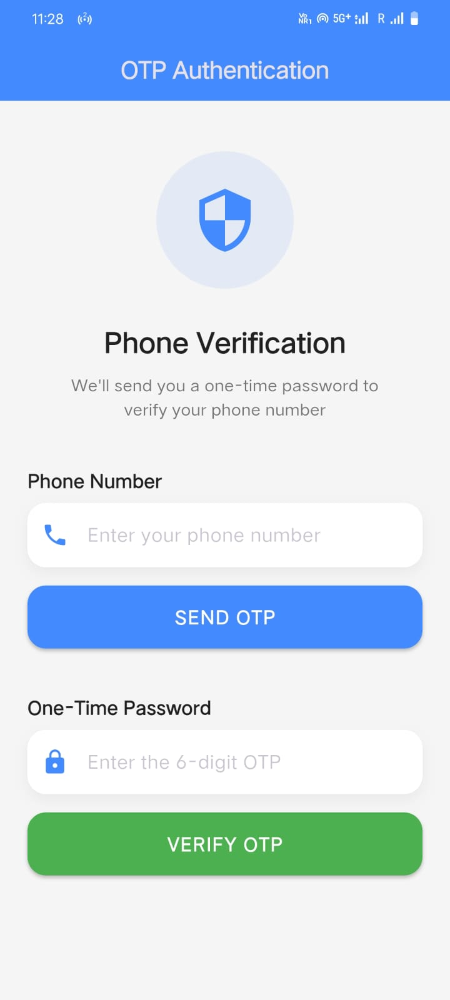
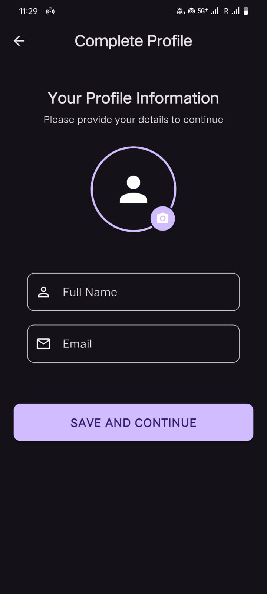
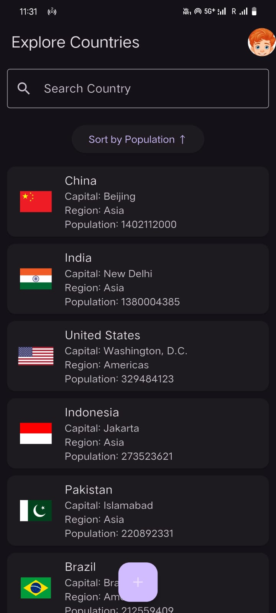
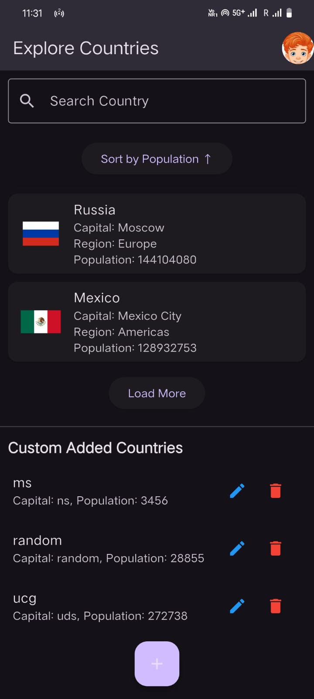
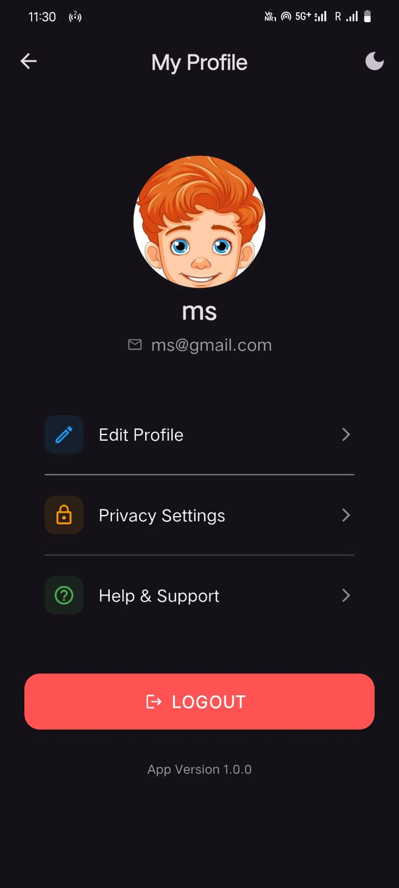

# Flutter Country App - Firebase, REST API & GetX State Management
## 📌 Overview
This Flutter application integrates Firebase OTP authentication, Firestore database, REST API, and GetX state management. Users can log in with their mobile number, manage personal details, fetch country data from an API, and perform CRUD operations on Firestore.
## 🎯 Features
- Firebase OTP Authentication
- Firestore Integration
- REST API Integration
- GetX State Management
- Firestore CRUD Operations
- Search & Sort Functionality
- Error Handling & Notifications
- Logout & Session Management
- Dark Mode using GetX
- Loading Indicators & Animations
- Pagination for Firestore data
- Offline Support using Firestore caching
- *Base64-Encoded Profile Image Storage** (instead of Firebase Storage)

📌 Authentication Details
This app uses test number and OTP during development.
  
## 📷 Screenshots
### Loading Screen

Login Screen

User Screen

Country Screen

Custom Added Countries 

Profile Screen


## 🚀 Setup Instructions
1. **Clone the Repository**
   ```bash
   git clone https://github.com/MohitShukla29/flutter_country_app.git
   cd flutter_country_app
   ```
2. **Install Dependencies**
   ```bash
   flutter pub get
   ```
3. **Firebase Setup**
   - Enable **Phone Authentication** in Firebase
   - Set up Firestore & Firebase Storage
   - Add `google-services.json` to `android/app/`
4. **Run the App**
   ```bash
   flutter run
   ```
## 🛠 Tech Stack
- Flutter (Dart)
- Firebase (Auth, Firestore)
- GetX (State Management, Routing, Snackbar)
- REST API (REST Countries API)
- HTTP Package
  
---
For any queries, reach out to me! 🎯
